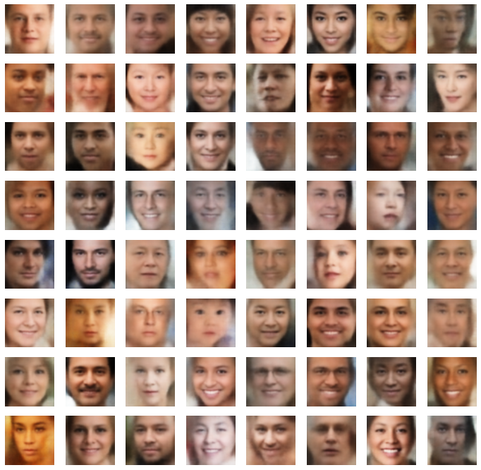

# face-generator-VAE
An attempt to generate faces using a convolutional variational autoencoder by training on the UTKFace dataset

# Dataset used
The dataset used is the cropped version of the UTKFace dataset. The dataset contains 128 by 128 images of human faces.  
It can be found [here](https://susanqq.github.io/UTKFace/)

# Objective
The objective of this project is to train a variational autoencoder to map an image to a multivariate probability distribution in a 2048
dimensional space whose distribution is a standard normal distribution. Random vectors can then be sampled from the distribution to generate random faces.

The objective of this project is to train a variational autoencoder on the UTKFace dataset so that new faces can be generated.  

- Unlike standard encoders which give a discrete values for encodings, Variational autoencoders create a latent space probability distribution.
 Reconstruction can then be done by sampling from the probability distributions in the encodings.  

- Variational autoencoders have a KL divergence term in their loss functions which forces the entire latent space for the encodings to be a standard normal multivariate        distribution.

- Since the latent space is now continuous, we can now sample from it and use the decoder to generate new meaningful images not present in the dataset (generation).

- The model uses convolutional layers for generating encodings and transposed convolutional layers to decode.

- 'mean squared error' has been used for the reconstruction loss.

# Training
The model was trained for 300 epochs on a GPU instance.  
The results of the model can be seen below ⬇️.  

# Requirements ✅
- ###### python 3.8.5
- ###### Anaconda 4.9.2+

Note: for running on a GPU instance you will require to download the respective CUDA and cuDNN (if the GPU present is CUDA compatible) versions to work with tensorflow.
CUDA compatibility can be checked [here](https://developer.nvidia.com/cuda-gpus)

# Weights
The weights of the network after training can be downloaded [here](https://drive.google.com/drive/folders/1KDRJRzU0rXM8M6CFXn9glJ-BZhI4a4hZ?usp=sharing) for testing purposes

# Instructions 📝 (For testing on CPU)
- Clone the repository
- Download the dataset from [here](https://susanqq.github.io/UTKFace/) into the same directory as the cloned repo (Only required for training from scratch)
- Download the weights from [here](https://drive.google.com/drive/folders/1KDRJRzU0rXM8M6CFXn9glJ-BZhI4a4hZ?usp=sharing)for testing
- Open anaconda prompt and cd into the repo
- Run `conda env create -f environment.yml`
- Run `jupyter notebook` and make sure you are using the kernel 'tensorflow-cpu'
- Run the notebook `face-generator.ipynb`

Note: It is advised to train the model on a GPU. Training on a CPU can be time consuming.

# Libraries used
- [Tensorflow](https://www.tensorflow.org/)
- [Keras](https://keras.io/)
- [Numpy](https://numpy.org/)

# Acknowledgments
- Ahlad Kumar's series on [Youtube](https://www.youtube.com/watch?v=w8F7_rQZxXk&list=PLdxQ7SoCLQANizknbIiHzL_hYjEaI-wUe) on variational autoencoders on youtube do help understand the theory
- The article "Intuitively Understanding Variational Autoencoders" on [Medium](https://towardsdatascience.com/intuitively-understanding-variational-autoencoders-1bfe67eb5daf)
